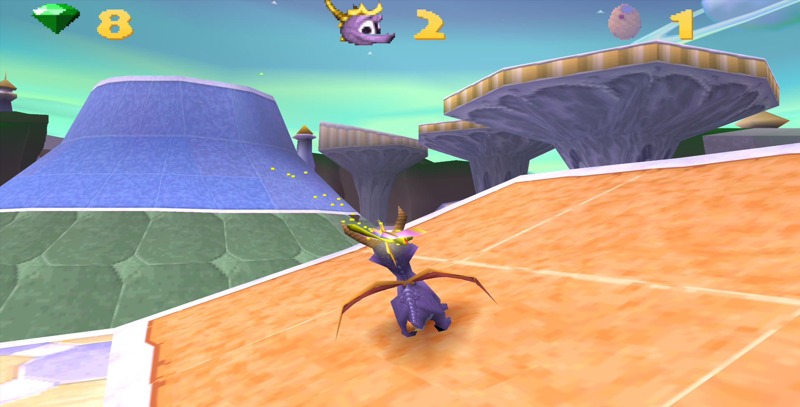
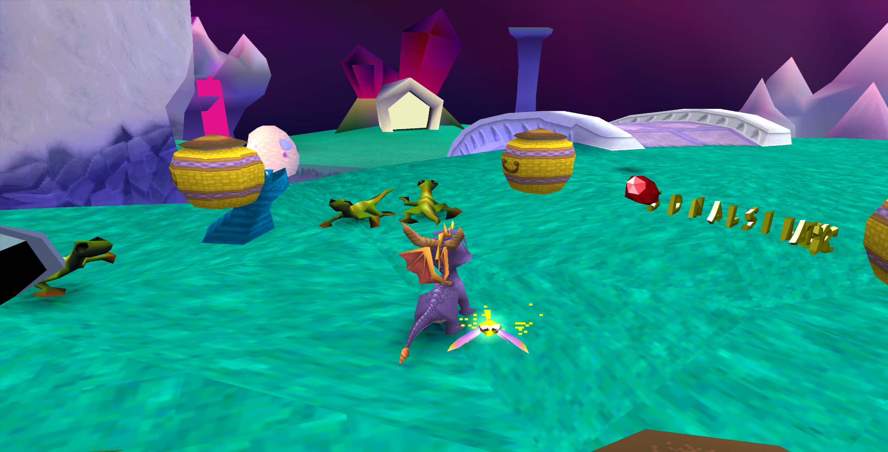
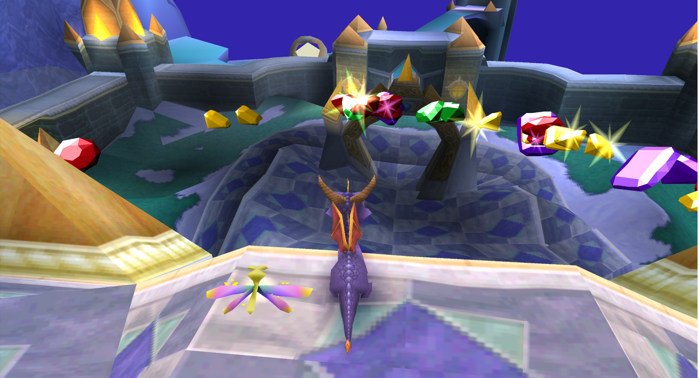
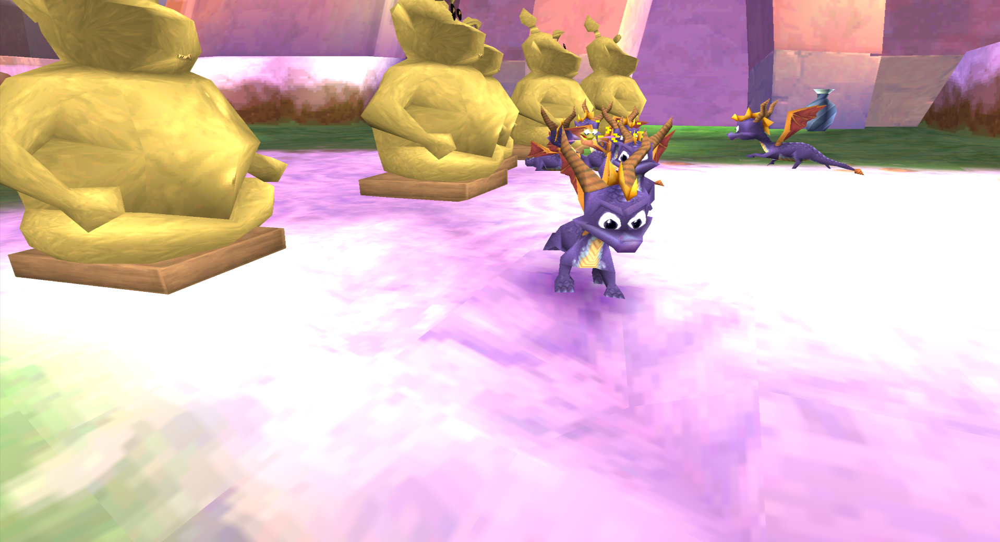

# SpyroEdit
SpyroEdit is a specialised emulator plugin for modifying the Spyro the Dragon games on the PlayStation 1. It's compatible with Windows emulators such as ePSXe and PCSX.  

Officially compatible with Spyro 2 and 3, with limited compatibilty for Spyro 1.  

# Screenshots

# Videos

# Features
* Edit level textures and colours!
* Replace level skies with skies from different levels! (Spyro 2 and 3 cross-compatible!)  
* Give Spyro cool and unruly powers, such as the Headbashpocalypse!  
* Edit object properties in-game!  
* Edit scenery and object positions with Genesis!  
* View and export Spyro and object models with Genesis! (.dae export now supported)  
* See the game through new eyes in a prototype Widescreen, HD 60FPS custom renderer!  
* MultiSpyro support: Lead your Army of Spyros with the Spyro trail! Includes limited online support  

# Updates
## 17th July 2018
* Skies are now rendered in the renderer!  
* Simple spark effects are now rendered in the renderer!  
* Bugfix: Spyro the Dragon now loads and appears to be compatible with Genesis scenery edits  
* Bugfix: Gems were invisible in Genesis  

## 26th June 2018
* Genesis now supports animation viewing  
* Genesis now supports model exporting to the collada (.dae) file format  
* Spyro Renderer added! Experimentally render the game in HD with an unlocked frame rate and with more texture options!  
* Object positions can now be saved and loaded!  
* Some slight interface changes were made whilst squeezing in the Render tab  
* Bugfix: Blank screen on NTSC version of Spyro 2 on some plugin (note: some unknown blank screen errors still persist)  
* Bugfix: Models weren't rendering correctly when sent to Genesis  
* Bugfix: Spyro's textures weren't being saved in some versions of the games. This may make object texture mods incompatible with old versions. Generally, the compatibility of object texture mods between different versions and states of the games is unreliable. Apologies!  
* Bugfix: Online mode was broken. The port has now been changed to **18541**.
* New bug! (Yay!): Genesis crashes when a new document is created, and some circumstances when objects are replaced with new ones. **Save regularly!**  

# Download
[SpyroEdit 2.3](https://github.com/LXShades/spyroedit/releases/download/v2.3/gpuSpyroEdit.dll)  
[SpyroEdit 2.2](https://github.com/LXShades/spyroedit/releases/download/v2.2/gpuSpyroEdit.dll)  
[SpyroEdit 2.1](https://github.com/LXShades/spyroedit/releases/download/v2.1-beta/gpuSpyroEdit.dll)  
[Genesis (for SpyroEdit 2.2 and 2.3)](https://github.com/LXShades/spyroedit/releases/download/v2.2/Genesis.exe)  
[Genesis (for SpyroEdit 2.1)](https://github.com/LXShades/spyroedit/releases/download/v2.1-beta/Genesis.exe)  

# Guides
[SpyroEdit 2.1 guide](spyroedit_guide.md)  
[Genesis guide](genesis_guide.md)